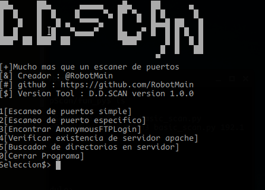

<h1>DDSCAN</h1> 
<h4>Un escaner de vulnerabilidades</h4> 

Este es un escanner de vulnerabilidades que estoy fabricando aun. 
Tengo pensado agregarle mas funcionalidades, por ahora solo hay 2 disponibles 
Para probarlo solo deben ejecutar el bash install.sh 
Despues compilar con gcc el fichero compile.c 
Y luego ejecutar el ./a.out

 

